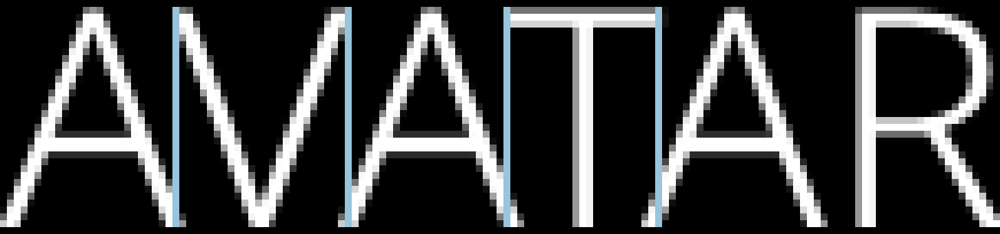
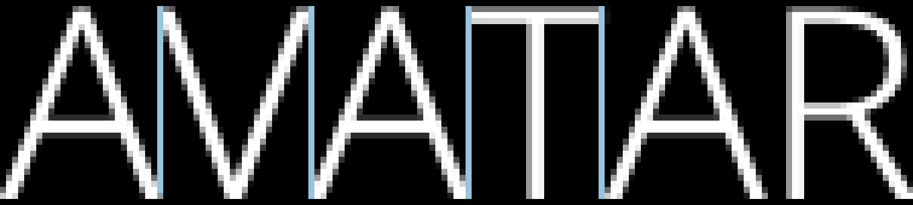

# Raylib Text Kerning Library

This library provides text kerning capability to raylib. This greatly improves
readability of non-monospace text.

Here is a screenshot with some lines drawn over to make the kerning more
obvious (this is taken from the examples in this repo):

Here is what native raylib looks like:

It is definitely slower than drawing non-kerned text, but if your game uses a
lot of text this could be useful. I have done some work trying to improve the
performance, mostly by indexing the font by font size with pre-rendered
bitmaps. See the example folder for usage.

In my experience, this results in a better rendering of the font than the
current SDL TTF library.

Note that stb_truetype.h and raylib.h are included here for convenience. You
should probably grab the latest versions of those, and you will also need to
compile the raylib library to use this.

# References

[raylib](https://github.com/raysan5/raylib) graphics library

Thank you to the
[stb-truetype-example](https://github.com/justinmeiners/stb-truetype-example)
repo for helping me understand how to use the core STBTT library.
